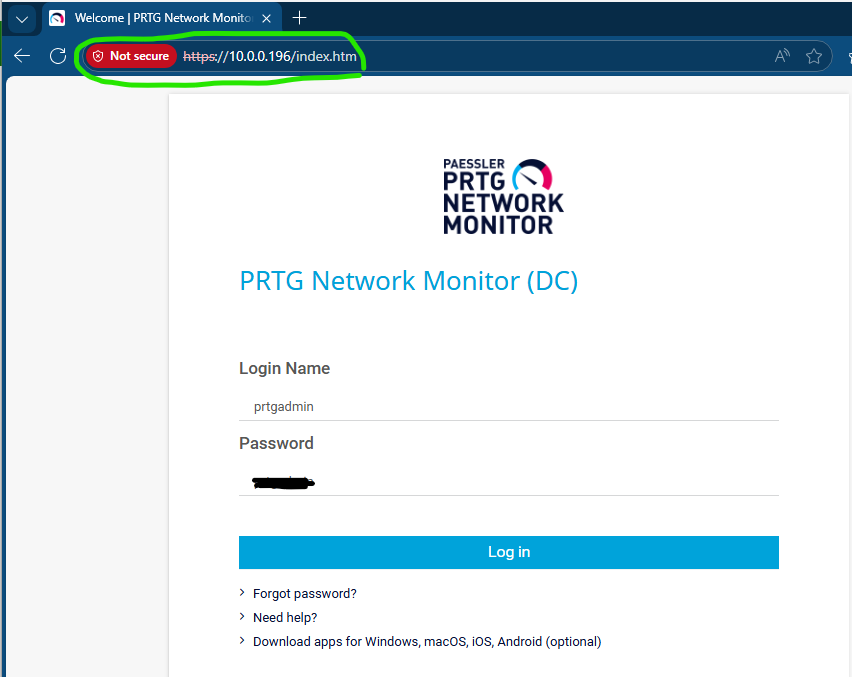
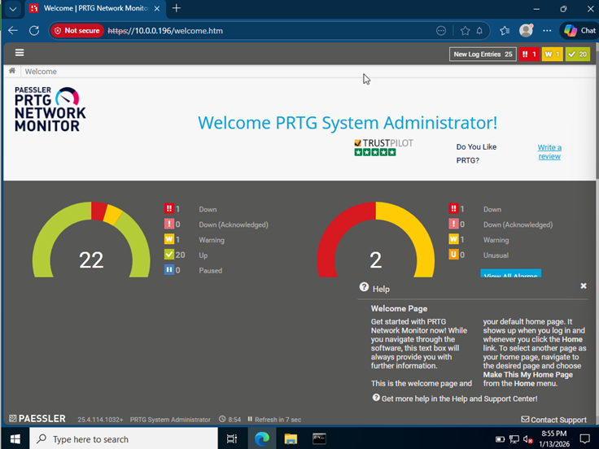
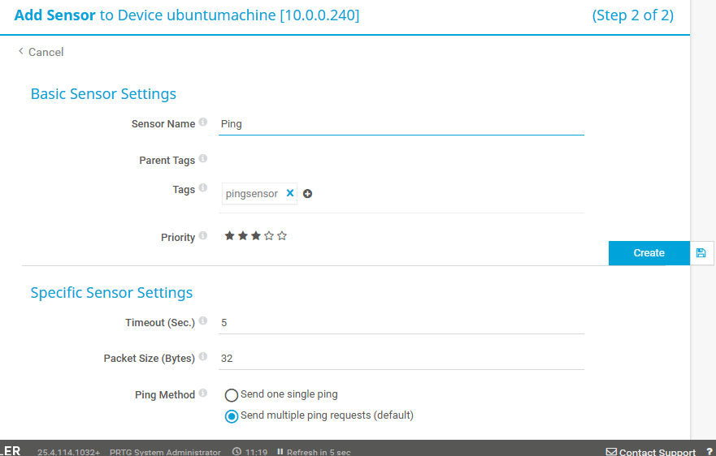
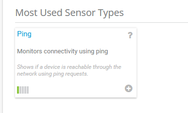
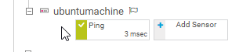
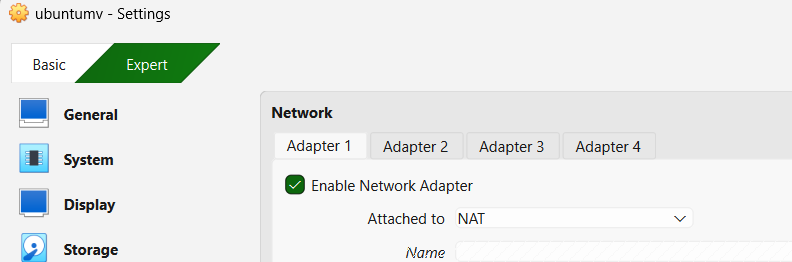
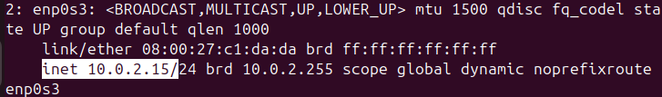
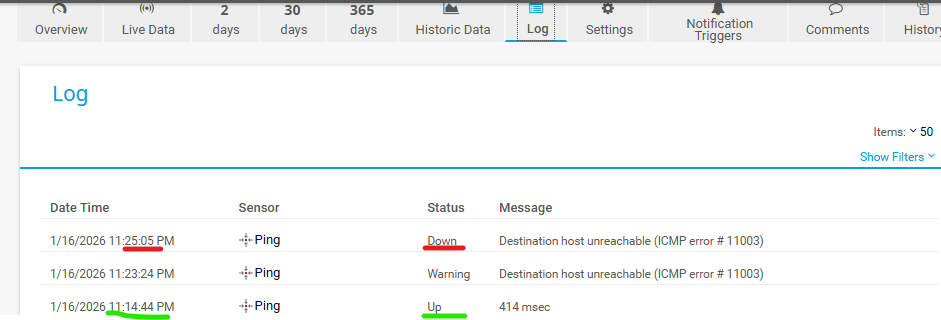

# Network-Monitoring-Lab-PRTG with Windows Server & Ubuntu
# Current Scope & Future Expansion
This lab focuses on validating core network connectivity and basic host availability monitoring using an ICMP (Ping) sensor.
While only a single monitored device and sensor were used in this initial phase, the environment was intentionally designed to support future expansion. Planned improvements include adding additional devices, multiple sensor types, and more advanced monitoring and alerting configurations.
This project serves as a foundational monitoring lab and will be expanded as additional network services and hosts are introduced.
---
 
This lab demonstrates basic network connectivity, monitoring, and fault detection using PRTG Network Monitor in a virtualized environment.
The setup consists of two virtual machines running on Oracle VirtualBox:
- Windows Server 2022 (PRTG monitoring server)
- Ubuntu Linux (monitored host)

**Both machines were initially configured on a Bridged Network, allowing them to reside on the same network and communicate directly.**

---
# Technologies Used
- Oracle VirtualBox
- Windows Server 2022
- Ubuntu Linux
- PRTG Network Monitor
- ICMP (Ping sensor) 
- Bridged & NAT Networking

---
# Network Configuration
Both virtual machines were connected using Bridged Networking
Each machine received an IP address from the same network

Connectivity was verified using ICMP ping in both directions:
- Windows Server → Ubuntu
- Ubuntu → Windows Server

Successful ping replies confirmed proper Layer 3 connectivity.

---
# PRTG Installation & Configuration
PRTG Network Monitor was installed on the Windows Server 2022 VM
The PRTG web interface was accessed via the server’s IP address in a browser

The dashboard provided visibility into:
- Sensors
- Device status
- Up / Down
- Alerts and warnings

--- 
# Device & Sensor Setup
The Ubuntu machine was added to PRTG as a new device
The device was configured using its assigned IP address

Initially, the device had no sensors
A Ping Sensor (ICMP) was manually added to monitor availability

Once added:
The sensor turned green, confirming successful connectivity
This verified that PRTG could actively monitor the Ubuntu host

---
# Fault Simulation & Monitoring Validation

To validate monitoring accuracy and alerting behavior:
The Ubuntu VM network adapter was changed from Bridged to NAT

This caused the Ubuntu machine to receive a different IP address
As a result:
PRTG lost connectivity to the monitored host
The Ping Sensor transitioned:

- 🟢 Green (Up)
- 🟡 Yellow (Warning)
- 🔴 Red (Down)

This confirmed that:
PRTG accurately detects host availability changes
Sensors respond correctly to real network disruptions
The Ubuntu VM was then reverted back to Bridged Networking, restoring connectivity, and the sensor returned to green status.

---
# Key Takeaways
- Verified virtual machine connectivity using bridged networking
- Successfully deployed and accessed PRTG Network Monitor
- Added and configured monitored devices and sensors
- Simulated network failures and observed real-time sensor state changes
- Demonstrated basic network monitoring and troubleshooting skills
